

# SAW Resonator Finite-Element Simulation

**A MATLAB + Gmsh piezoelectric finite-element solver**
for the frequency-domain simulation and design of Surface Acoustic Wave (SAW) resonators and filters

**English** · [简体中文](README.zh-CN.md)

Author · [Shaoqing Duan](https://github.com/Duane245)

---

## 📑 Contents

- [Overview](#intro)
- [Capabilities](#capability)
- [Methodology](#method)
- [Worked Example](#showcase)
- [Model Library](#library) · [SP-2D](#sp2d) · [SP-2.5D](#sp25d) · [FP-2D](#fp2d) · [FP-2.5D](#fp25d)
- [Tech Stack](#stack)
- [Code Demo](#demo)
- [Contact & Collaboration](#contact)

---

## 📖 Overview

Surface Acoustic Wave (SAW) resonators are the core building block of RF front-end filters, widely deployed in mobile communications, IoT and sensing. This project implements a piezoelectric finite-element (FEM) solver covering the piezoelectric constitutive law and crystal tensor handling, complex-coordinate-stretched PML, vectorized FE assembly, `parfor` parallel frequency sweeps and Y11 post-processing — for the frequency-domain (harmonic) analysis of SAW resonators.

Under interdigital-transducer (IDT) excitation, the solver jointly solves the structural-mechanics displacement field `u` and the electrostatic potential field `φ` of the piezoelectric coupling equations, sweeps over a specified band, and outputs the **Y11 admittance curve** of the device — the key indicator used to evaluate SAW resonator / filter performance (resonant frequency, electromechanical coupling coefficient, quality factor).

| | |
|---|---|
| 🧩 **Piezoelectric multiphysics** | Fully coupled displacement–potential analysis with anisotropic piezoelectric single crystals such as LiNbO₃ and LiTaO₃ |
| 🌊 **Perfectly Matched Layer (PML)** | Complex coordinate stretching absorbs outgoing waves and accurately mimics a semi-infinite substrate, suppressing bulk-wave reflection |
| 📐 **Parametric modelling** | Parametric Gmsh meshes — all key geometric dimensions are scripted parameters and can be adjusted in a single edit |
| ⚡ **Parallel frequency sweep** | `parfor` multi-core parallelism (801-point 2-D case ≈ 8 s) |

---

## 🎯 Capabilities

| Dimension | Supported scope |
|---|---|
| **Spatial dimension** | 2D / 2.5D (9-node quadrilateral Q9, 27-node hexahedral Hex27 high-order elements) |
| **Device model** | Single-period unit cell (Bloch periodic BC); finite device (free / floating-potential BC) |
| **Stack** | Single up to multilayer (1–4 layers) of piezoelectric / dielectric stacks |
| **Special process** | Temperature-compensated SAW (TC-SAW) with SiO₂ / Si₃N₄ compensation layers |
| **Analysis mode** | Plane-strain analysis; 2.5D mode-extension analysis |
| **Materials** | Arbitrary-cut anisotropic piezoelectric single crystals (Euler-angle rotation) + metal electrodes |
| **Problem size** | 2D ~10⁴ DOFs; 2.5D up to **~10⁶ DOFs** |

---

## 🔬 Methodology

### ① Piezoelectric coupling model

In a SAW device, mechanical vibration is strongly coupled to the electric field through the **piezoelectric effect**. The solver works in the frequency domain and jointly solves for the **structural displacement field `u`** and the **electrostatic potential field `φ`** — the two are coupled through the piezoelectric constitutive law, with material properties described by the density `ρ`, elastic stiffness tensor `C`, piezoelectric coupling tensor `e` and permittivity tensor `ε`. Anisotropic piezoelectric single crystals such as LiNbO₃ and LiTaO₃ have their crystal tensors **rotated by Euler angles** from the crystallographic frame into the device frame to match the actual wafer cut.

### ② Parametric mesh generation

Geometry and meshing are driven by **Gmsh**. The IDT pitch, acoustic wavelength, electrode thickness, metallization ratio, PML thickness and mesh seeding are all scripted parameters, so a new design can be remeshed in a single edit. Mesh entities are tagged into physical groups so that the piezoelectric body, electrodes, functional sublayers, PML regions and the various boundaries are picked up automatically.

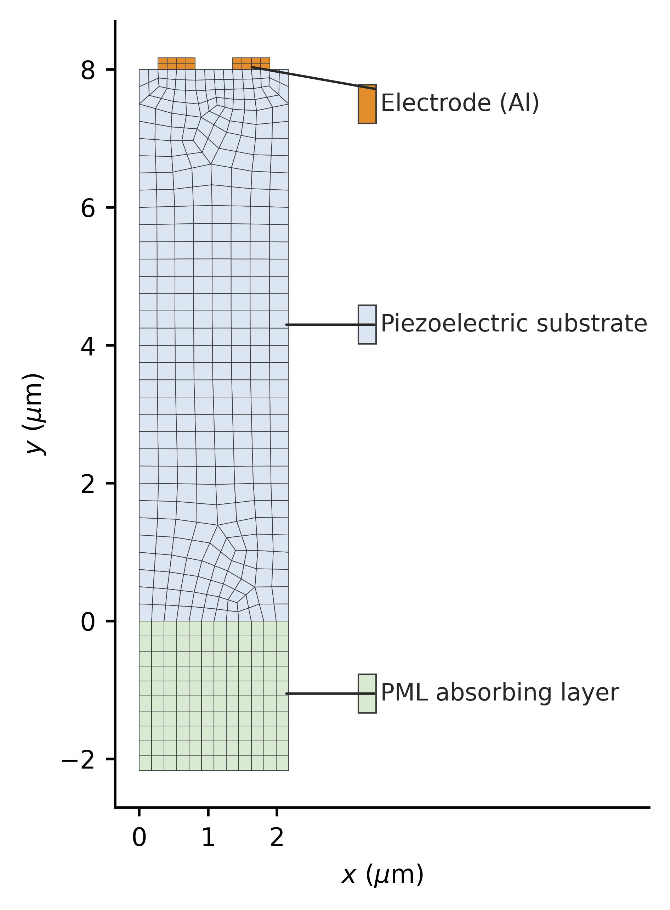 
<b>Fig. 1</b> · Finite-element mesh of a SAW resonator periodic cell — coloured by material to show the piezoelectric substrate, IDT electrodes (Al) and bottom PML absorber

### ③ FE discretization and PML absorbing boundary

The computational domain is discretized with **high-order elements** — 9-node quadrilaterals (Q9) in 2D and 27-node hexahedra (Hex27) in 2.5D. DOFs are ordered as `[displacement u | potential φ]`; the mass matrix `M` and stiffness matrix `K` are assembled to form the fully coupled displacement–potential FE system.

**Matrix assembly is implemented in a vectorized fashion.** A conventional element-by-element `for` loop is doubly penalised in an interpreted language such as MATLAB: first, the interpreter re-enters the loop body once per element, accumulating overhead with the element count; second, every element accumulates into the sparse matrix by indexed assignment (`K(dof,dof) = K(dof,dof) + Ke`), and each such insertion triggers a re-layout and re-allocation of the sparse structure — particularly costly for the 2.5D models that exceed one million DOFs. The solver replaces this with **batch vectorized assembly**: it computes the Jacobians, strain–displacement matrices and per-element contributions for all elements at once, aggregates them into global `(i, j, v)` triplets, then calls `sparse()` once to materialise `K / M`. By eliminating both the explicit loop and the repeated insertions, assembly time drops dramatically — this is the enabler that makes million-DOF simulations tractable.

A **Perfectly Matched Layer (PML)** is placed at the bottom and the lateral sides of the device. Through complex coordinate stretching, outgoing bulk waves are attenuated along a prescribed profile inside the PML — equivalent to a semi-infinite substrate — so that energy leakage and the resonance Q-factor are captured accurately.

### ④ Frequency-domain sweep

The solver supports two boundary-condition flavours: the **finite-device model (FP)** mimics a real, finite multi-finger IDT — fixed at the bottom, free on the sides — and corresponds directly to the actual chip layout; the **single-period model (SP)** takes a single unit cell with Bloch periodic boundaries on the left and right, equivalent to an infinitely long periodic array at a tiny fraction of the cost.

Within the specified band, every frequency point is solved in turn: a dynamic matrix is built, boundary conditions and the IDT-voltage excitation are applied, the coupled piezoelectric linear system is solved for displacement and potential, and the induced charge `Q` on the signal electrode is integrated to give the admittance `Y₁₁ = |iωQ/V|`. The frequency points are independent of one another and are evaluated in parallel via `parfor`.

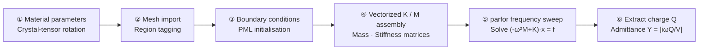

---

## 📊 Worked Example: 2-D Periodic Unit Cell

A 2-D periodic-cell model is used here to illustrate the full physical fields produced by the solver. Under AC IDT excitation, the solver simultaneously delivers the displacement and electric-potential fields inside the device.

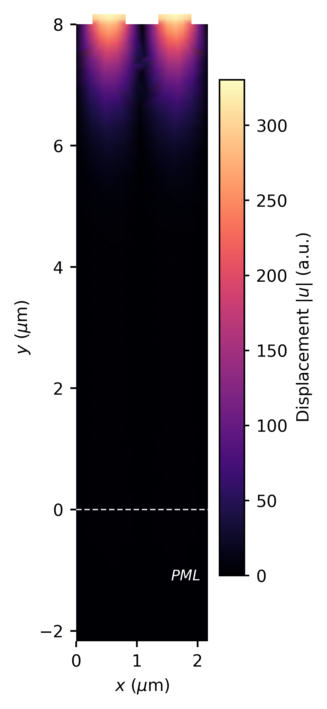
&nbsp;&nbsp;
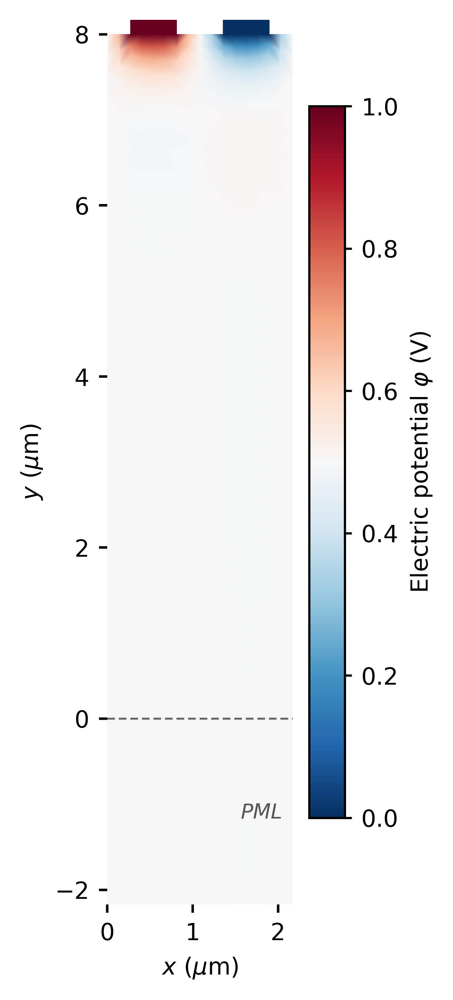
 
<b>Fig. 2</b> · Displacement-field magnitude at resonance (f_r ≈ 1.81 GHz) — energy concentrated near the surface and damped to zero inside the PML &nbsp;|&nbsp; <b>Fig. 3</b> · Potential field — positive/negative electrodes set up the field that, via the piezoelectric effect, launches the acoustic wave

The admittance is computed from the induced charge `Q` on the signal electrode: **`Y = |iωQ / V|`**. **Peaks** on the admittance curve mark the **resonance** (low impedance) and **troughs** mark the **anti-resonance** (high impedance); the spacing between them reflects the electromechanical coupling strength of the device.

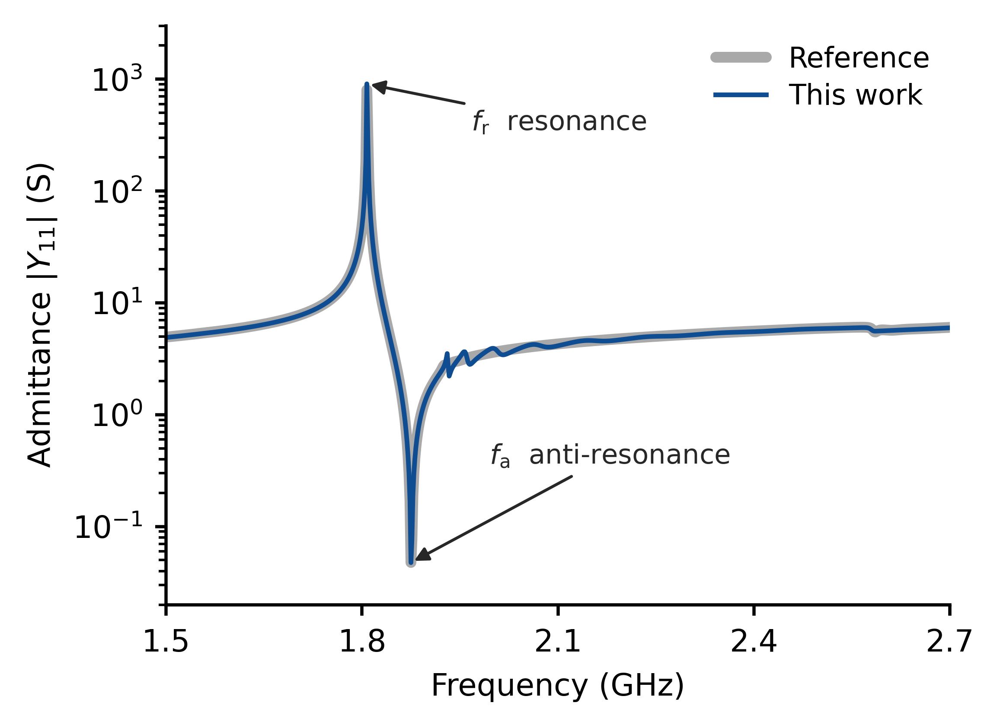 
<b>Fig. 4</b> · Y11 admittance curve — the resonance peak f_r and the anti-resonance trough f_a are clearly resolved, characterising the harmonic response of the device

---

## 📚 Model Library

The solver ships with a **library of 17 SAW cases** spanning 2D / 2.5D, single-period (SP) / finite-device (FP), single up to multilayer stacks and the temperature-compensated (TC-SAW) variant. Each family includes a model-spec table, structural / field visualisations and a composite Y11 plot. The ordering below is "SP before FP, 2D before 2.5D".

### 🔹 SP-2D — 2-D Periodic Unit Cell

A single periodic unit cell with Bloch periodic boundaries on the left and right, equivalent to an infinitely long periodic IDT. Covers 1- to 4-layer stacks; one further case is a **temperature-compensated SAW (TC-SAW)** that stacks SiO₂ / Si₃N₄ compensation layers on top of the piezoelectric film to suppress the temperature drift of the resonant frequency.

| Case | Stack (substrate → top) | Nodes | Sweep (GHz) | f_r (GHz) |
|:---|:---:|---:|:---:|---:|
| `SP_2D_1ceng` | LiTaO₃ | 1,563 | 1.50 – 2.70 | 1.81 |
| `SP_2D_2ceng` | LiTaO₃ / Si | 1,465 | 1.50 – 2.70 | 1.82 |
| `SP_2D_3ceng` | LiTaO₃ / SiO₂ / Poly-Si | 1,465 | 1.50 – 2.70 | 1.76 |
| `SP_2D_4ceng` | LiTaO₃ / SiO₂ / Poly-Si / Si | 1,601 | 1.50 – 2.70 | 1.76 |
| `SP_2D_TCSAW` | LiNbO₃ / SiO₂ / Si₃N₄ (TC) | 12,565 | 1.60 – 2.00 | 1.76 |

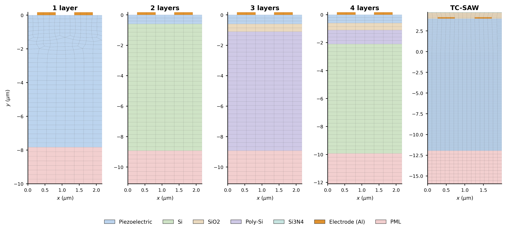 
<b>Fig. 5</b> · SP-2D periodic-cell meshes — coloured by material to show the piezoelectric layer, functional sublayers, electrodes and PML
  
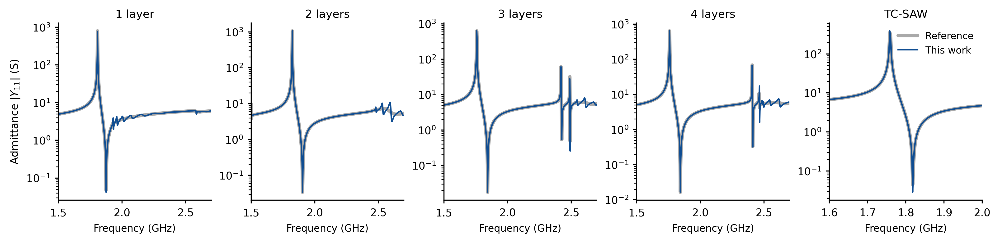 
<b>Fig. 6</b> · Y11 admittance curves of the SP-2D series

### 🔹 SP-2.5D — 2.5-D Periodic Unit Cell

2.5-D periodic-cell models discretized with 27-node hexahedral (Hex27) high-order elements; periodic boundaries are applied front-back and left-right, modelling a finite-aperture periodic IDT.

| Case | Stack | Nodes | Sweep (GHz) | f_r (GHz) |
|:---|:---:|---:|:---:|---:|
| `SP_3D_1ceng` | Single layer | 8,127 | 1.50 – 2.70 | 1.81 |
| `SP_3D_2ceng` | Two layers | 8,721 | 1.75 – 2.00 | 1.84 |
| `SP_3D_3ceng` | Three layers | 9,513 | 1.60 – 2.00 | 1.76 |
| `SP_3D_4ceng` | Four layers | 10,305 | 1.80 – 2.10 | 1.90 |

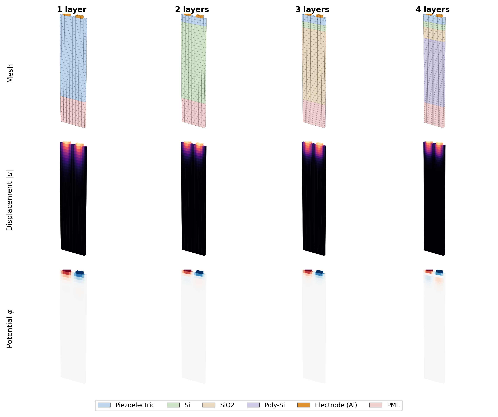 
<b>Fig. 7</b> · SP-2.5D overview: mesh, displacement field and potential field
  
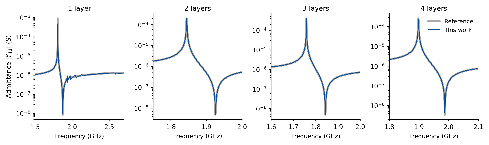 
<b>Fig. 8</b> · Y11 admittance curves of the SP-2.5D series

### 🔹 FP-2D — 2-D Finite Device

Real finite-length device models (multi-finger IDT arrays), fixed at the bottom and free on the sides — corresponding directly to the actual chip layout.

| Case | Stack (substrate → top) | Nodes | Sweep (GHz) | f_r (GHz) |
|:---|:---:|---:|:---:|---:|
| `FP_2D_1ceng` | LiTaO₃ | 17,349 | 1.60 – 2.00 | 1.70 |
| `FP_2D_2ceng` | LiTaO₃ / Si | 17,829 | 1.60 – 2.00 | 1.73 |
| `FP_2D_3ceng` | LiTaO₃ / SiO₂ / Si | 18,809 | 1.60 – 2.00 | 1.66 |
| `FP_2D_4ceng` | LiTaO₃ / SiO₂ / Poly-Si / Si | 20,769 | 1.60 – 2.00 | 1.66 |

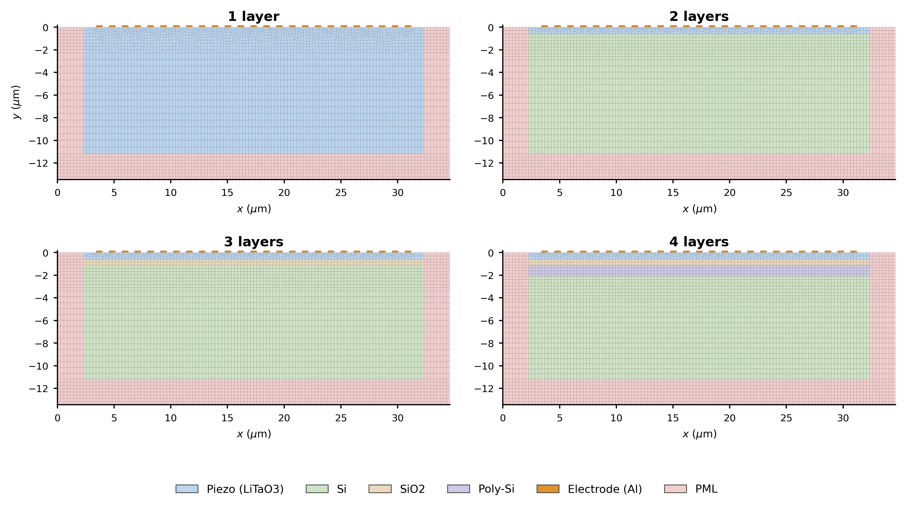 
<b>Fig. 9</b> · FP-2D finite-element meshes — coloured by material to show the piezoelectric layer, functional sublayers, electrodes and PML absorber
  
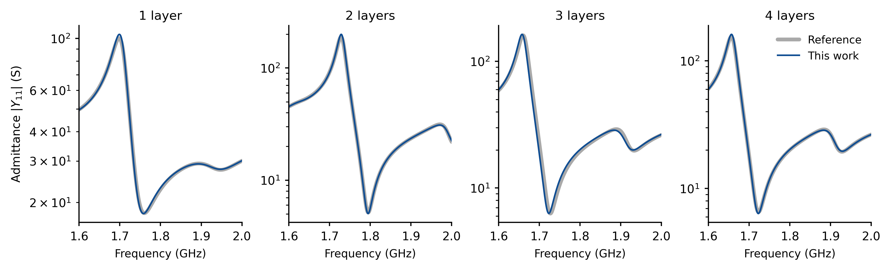 
<b>Fig. 10</b> · Y11 admittance curves of the FP-2D series

### 🔹 FP-2.5D — 2.5-D Finite Device

The largest models in the library — the biggest mesh exceeds 270,000 nodes and one million DOFs, demonstrating the solver's capacity for large-scale problems.

| Case | Stack | Nodes | Sweep (GHz) | f_r (GHz) |
|:---|:---:|---:|:---:|---:|
| `FP_3D_1ceng` | Single layer | 273,627 | 1.80 – 2.20 | 1.88 |
| `FP_3D_2ceng` | Two layers | 86,835 | 1.75 – 2.00 | 1.81 |
| `FP_3D_3ceng` | Three layers | 207,453 | 1.60 – 2.00 | 1.85 |
| `FP_3D_4ceng` | Four layers | 66,585 | 1.80 – 2.10 | 1.87 |

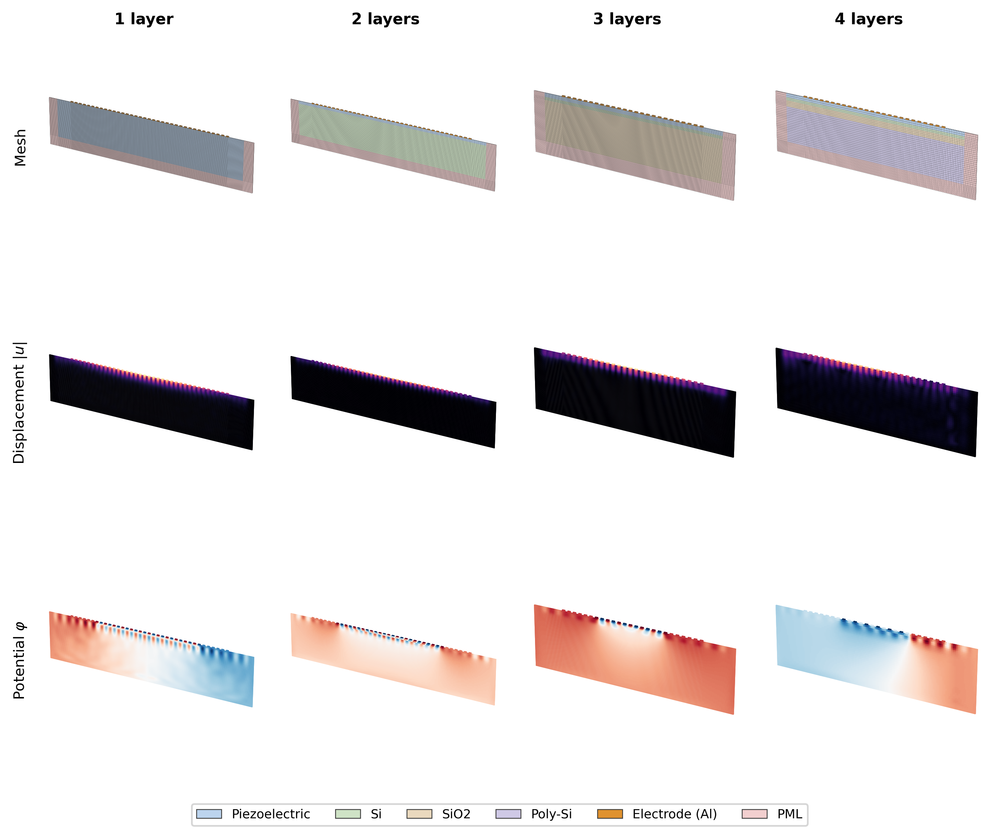 
<b>Fig. 11</b> · FP-2.5D overview: mesh, displacement field and potential field
  
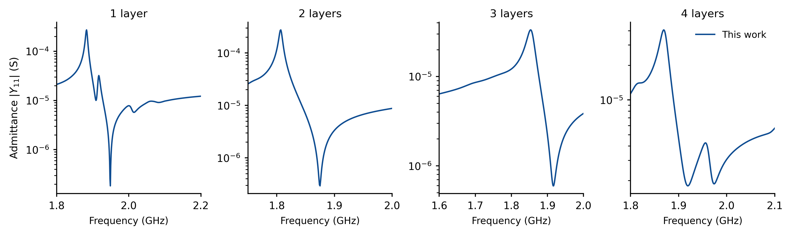 
<b>Fig. 12</b> · Y11 admittance curves of the FP-2.5D series — harmonic response of large-scale finite-device models

---

## 🛠️ Tech Stack

| Tool | Role |
|---|---|
| **MATLAB** (with Parallel Computing Toolbox) | FE assembly and `parfor` parallel frequency-domain solve |
| **Gmsh** | Parametric geometry and meshing |
| **Python / matplotlib** | Gmsh scripting interface and post-processing visualisation |

---

## 💻 Code Demo · 2D TCSAW

A ready-to-run **temperature-compensated SAW (TC-SAW)** 2-D periodic-cell demo is bundled with this repository → [`2DTCSAW/`](2DTCSAW/)

- **Physics**: LiNbO₃ substrate + SiO₂ / Si₃N₄ compensation layers + Al IDT
- **Method**: Q9 elements · Bloch periodic BC · complex-coordinate-stretched PML
- **Run**: `cd 2DTCSAW && matlab -batch "SolveSAW"` (≈ 5 min, single process)
- **Output**: `Y11.mat` + mesh / displacement / potential / Y₁₁ admittance figures

Requires MATLAB R2023a+ only — no extra toolboxes needed. See [`2DTCSAW/README.md`](2DTCSAW/README.md) for details. Released under the [MIT License](LICENSE); version history in [`CHANGELOG.md`](CHANGELOG.md).

---

## 🤝 Contact & Collaboration

Discussions on SAW simulation, piezoelectric FEM and PML implementations are very welcome; academic collaborations, industry consulting and pull requests are equally welcome.

- 🐛 **Issues** · [GitHub Issues](../../issues) — bug reports and feature requests
