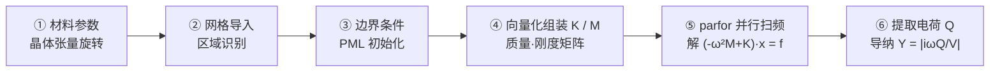

# SAW 声表面波谐振器有限元仿真

**MATLAB + Gmsh 压电耦合有限元求解器**
面向声表面波（SAW）谐振器与滤波器的频域仿真及器件设计

[English](README.md) · **简体中文**

Author · [Shaoqing Duan](https://github.com/Duane245)

---

## 📑 目录

- [项目简介](#intro)
- [核心能力](#capability)
- [技术路线](#method)
- [算例详解](#showcase)
- [模型库](#library) · [SP-2D](#sp2d) · [SP-2.5D](#sp25d) · [FP-2D](#fp2d) · [FP-2.5D](#fp25d)
- [技术栈](#stack)
- [代码示例](#demo)
- [交流与合作](#contact)

---

## 📖 项目简介

声表面波（Surface Acoustic Wave, SAW）谐振器是射频前端滤波器的核心元件，广泛应用于移动通信、物联网与传感等领域。本项目实现了一套压电耦合有限元（FEM）求解器，涵盖压电本构与晶体张量、复坐标拉伸 PML、有限元向量化组装、`parfor` 并行扫频与 Y11 后处理，用于 SAW 谐振器的频域（谐响应）仿真。

求解器在叉指换能器（IDT）激励下，联立求解结构力学位移场 `u` 与静电电势场 `φ` 的压电耦合方程，在指定频段内逐频点扫描，最终给出器件的 **Y11 导纳特性曲线** —— 这是评价 SAW 谐振器 / 滤波器性能（谐振频率、机电耦合系数、品质因数）的关键指标。

| | |
|---|---|
| 🧩 **压电多物理耦合** | 位移–电势全耦合，支持铌酸锂、钽酸锂等各向异性压电单晶 |
| 🌊 **完美匹配层（PML）** | 复数坐标拉伸吸收边界，精确模拟半无限大衬底，抑制体波反射 |
| 📐 **参数化建模** | 基于 Gmsh 的参数化网格，几何尺寸一键调整 |
| ⚡ **并行扫频** | 频域扫描采用 `parfor` 多核并行（801 频点二维算例约 8 秒） |

---

## 🎯 核心能力

| 维度 | 支持范围 |
|---|---|
| **空间维度** | 2D / 2.5D（9 节点四边形 Q9、27 节点六面体 Hex27 高阶单元）|
| **器件模型** | 单周期单元模型（Bloch 周期边界）、有限器件模型（自由 / 悬浮电势边界）|
| **叠层结构** | 单层至多层（1–4 层）压电 / 介质叠层 |
| **特殊工艺** | 温度补偿型 SAW（TC-SAW），含 SiO₂ / Si₃N₄ 补偿层 |
| **分析模式** | 平面应变分析、2.5D 模态扩展分析 |
| **材料体系** | 任意切型各向异性压电单晶（欧拉角旋转）+ 金属电极 |
| **计算规模** | 2D ~10⁴ 自由度，2.5D 最大达 **百万级**自由度 |

---

## 🔬 技术路线

### ① 压电耦合物理模型

声表面波器件中，机械振动与电场通过**压电效应**强耦合。求解器在频域内联立求解**结构力学位移场 `u`** 与**静电电势场 `φ`** —— 二者经压电本构关系耦合，材料属性由密度 `ρ`、弹性刚度张量 `C`、压电耦合张量 `e`、介电常数张量 `ε` 共同描述。铌酸锂（LiNbO₃）、钽酸锂（LiTaO₃）等各向异性压电单晶的晶体张量经**欧拉角旋转**变换到器件坐标系，以匹配实际晶圆切型。

### ② 参数化网格生成

采用 **Gmsh** 进行参数化几何建模与网格剖分。叉指周期（pitch）、声波波长、电极厚度、金属化比、PML 厚度、网格离散尺寸等关键尺寸均为脚本参数，可快速生成不同设计的网格。网格按物理组标签自动区分压电体、电极、功能衬层、PML 区域与各类边界。

 
<b>图 1</b> · SAW 谐振器周期单元的有限元网格 —— 按材料分区显示压电衬底、叉指电极（Al）与底部 PML 吸收层

### ③ 有限元离散与 PML 吸收边界

计算域以**高阶单元**离散 —— 2D 采用 9 节点四边形（Q9），2.5D 采用 27 节点六面体（Hex27）。自由度按 `[位移 u | 电势 φ]` 排列，组装质量矩阵 `M` 与刚度矩阵 `K`，形成位移–电势全耦合的有限元系统。

**矩阵组装采用向量化（vectorized）实现。** 传统的逐单元 `for` 循环组装在 MATLAB 等解释型语言中存在两重劣势：一是解释器需对每个单元重复执行循环体，单元数越多累积开销越大；二是每个单元都以下标方式向稀疏矩阵累加（`K(dof,dof) = K(dof,dof) + Ke`），每次插入都会触发稀疏结构的重排与重新分配，对逾百万自由度的 2.5D 大模型尤为耗时。求解器改为**批量向量化组装**：一次性对全部单元并行计算雅可比、应变–位移矩阵与单元贡献，汇总为全局三元组 `(i, j, v)`，再以单次 `sparse()` 调用直接生成 `K / M`。这一方式消除了显式循环与逐次插入，使大规模算例的组装耗时大幅下降，是支撑百万级自由度仿真的关键。

器件底部与周边布置**完美匹配层（PML）** —— 通过复数坐标拉伸，使向外辐射的体波在 PML 内沿设定衰减廓线迅速衰减，等效模拟半无限大衬底，从而准确捕捉能量泄漏与谐振品质因数。

### ④ 频域扫频求解

求解器支持两类边界模型：**有限器件（FP）** 模拟有限尺寸的真实多指叉指器件，底部固定、两侧自由边界，直接对应实际芯片版图；**周期单元（SP）** 仅取一个周期单元、左右施加 Bloch 周期边界，以极小计算量等效无限长周期阵列。

在指定频段内逐频点求解：每个频率下构造动态矩阵、施加边界条件与叉指电极电压激励，求解压电耦合线性系统得到位移与电势，再由信号电极感应电荷 `Q` 计算导纳 `Y₁₁ = |iωQ/V|`。各频点相互独立，采用 `parfor` 多核并行加速。

---

## 📊 算例详解：二维周期单元

以一个二维周期单元模型为例，展示求解器输出的完整物理场。在叉指换能器交流激励下，求解器同时给出器件内部的位移场与电势场。

&nbsp;&nbsp;

 
<b>图 2</b> · 谐振态（f_r ≈ 1.81 GHz）位移场幅值 —— 能量集中于表面、PML 内归零 &nbsp;|&nbsp; <b>图 3</b> · 电势场 —— 正负电极建立电场、经压电效应激励声波

导纳由信号电极上的感应电荷 `Q` 计算：**`Y = |iωQ / V|`**。导纳曲线上的**峰值对应谐振**（低阻抗），**谷值对应反谐振**（高阻抗），二者的频率间隔反映器件的机电耦合强度。

 
<b>图 4</b> · Y11 导纳曲线 —— 谐振峰 f_r 与反谐振谷 f_a 清晰可见，体现器件的谐响应特征

---

## 📚 模型库

本求解器覆盖 **SAW 算例库共 17 个算例**，系统涵盖 2D / 2.5D、单周期单元（SP）/ 有限器件（FP）、单层至多层、温度补偿（TC-SAW）等典型结构。每类给出模型规格表、结构 / 场分布可视化与 Y11 导纳合集。下列按「先单周期、后有限长，先 2D、后 2.5D」编排。

### 🔹 二维周期单元模型（SP-2D）

单个周期单元，左右施加 Bloch 周期边界，等效模拟无限长周期叉指阵列。涵盖 1–4 层叠层结构；另含一例**温度补偿型 SAW（TC-SAW）**，在压电层上叠加 SiO₂ / Si₃N₄ 补偿层以抑制谐振频率的温度漂移。

| 算例 | 叠层结构（衬底→上） | 节点数 | 扫频范围 (GHz) | 谐振 f_r (GHz) |
|:---|:---:|---:|:---:|---:|
| `SP_2D_1ceng` | LiTaO₃ | 1,563 | 1.50 – 2.70 | 1.81 |
| `SP_2D_2ceng` | LiTaO₃ / Si | 1,465 | 1.50 – 2.70 | 1.82 |
| `SP_2D_3ceng` | LiTaO₃ / SiO₂ / Poly-Si | 1,465 | 1.50 – 2.70 | 1.76 |
| `SP_2D_4ceng` | LiTaO₃ / SiO₂ / Poly-Si / Si | 1,601 | 1.50 – 2.70 | 1.76 |
| `SP_2D_TCSAW` | LiNbO₃ / SiO₂ / Si₃N₄（温补） | 12,565 | 1.60 – 2.00 | 1.76 |

 
<b>图 5</b> · SP-2D 系列周期单元有限元网格 —— 按材料分区显示压电层、功能衬层、电极与 PML
  
 
<b>图 6</b> · SP-2D 系列 Y11 导纳曲线

### 🔹 2.5D 周期单元模型（SP-2.5D）

2.5D 周期单元，采用 27 节点六面体（Hex27）高阶单元，前后 / 左右施加周期边界，模拟有限孔径下的周期叉指结构。

| 算例 | 结构 | 节点数 | 扫频范围 (GHz) | 谐振 f_r (GHz) |
|:---|:---:|---:|:---:|---:|
| `SP_3D_1ceng` | 单层 | 8,127 | 1.50 – 2.70 | 1.81 |
| `SP_3D_2ceng` | 双层 | 8,721 | 1.75 – 2.00 | 1.84 |
| `SP_3D_3ceng` | 三层 | 9,513 | 1.60 – 2.00 | 1.76 |
| `SP_3D_4ceng` | 四层 | 10,305 | 1.80 – 2.10 | 1.90 |

 
<b>图 7</b> · SP-2.5D 系列网格、位移场、电势场总览
  
 
<b>图 8</b> · SP-2.5D 系列 Y11 导纳曲线

### 🔹 二维有限器件模型（FP-2D）

有限长度的真实器件模型（多指电极阵列），底部固定、两侧自由边界，直接对应实际芯片版图。

| 算例 | 叠层结构（衬底→上） | 节点数 | 扫频范围 (GHz) | 谐振 f_r (GHz) |
|:---|:---:|---:|:---:|---:|
| `FP_2D_1ceng` | LiTaO₃ | 17,349 | 1.60 – 2.00 | 1.70 |
| `FP_2D_2ceng` | LiTaO₃ / Si | 17,829 | 1.60 – 2.00 | 1.73 |
| `FP_2D_3ceng` | LiTaO₃ / SiO₂ / Si | 18,809 | 1.60 – 2.00 | 1.66 |
| `FP_2D_4ceng` | LiTaO₃ / SiO₂ / Poly-Si / Si | 20,769 | 1.60 – 2.00 | 1.66 |

 
<b>图 9</b> · FP-2D 系列有限元网格 —— 按材料分区显示压电层、功能衬层、电极与 PML 吸收层
  
 
<b>图 10</b> · FP-2D 系列 Y11 导纳曲线

### 🔹 2.5D 有限器件模型（FP-2.5D）

2.5D 有限长度器件模型，是算例库中规模最大的一类 —— 最大网格逾 27 万节点、逾百万自由度，体现求解器对大规模问题的处理能力。

| 算例 | 结构 | 节点数 | 扫频范围 (GHz) | 谐振 f_r (GHz) |
|:---|:---:|---:|:---:|---:|
| `FP_3D_1ceng` | 单层 | 273,627 | 1.80 – 2.20 | 1.88 |
| `FP_3D_2ceng` | 双层 | 86,835 | 1.75 – 2.00 | 1.81 |
| `FP_3D_3ceng` | 三层 | 207,453 | 1.60 – 2.00 | 1.85 |
| `FP_3D_4ceng` | 四层 | 66,585 | 1.80 – 2.10 | 1.87 |

 
<b>图 11</b> · FP-2.5D 系列网格、位移场、电势场总览
  
 
<b>图 12</b> · FP-2.5D 系列 Y11 导纳曲线 —— 大规模有限器件模型的谐振特性

---

## 🛠️ 技术栈

| 工具 | 用途 |
|---|---|
| **MATLAB**（含 Parallel Computing Toolbox） | 有限元组装与 `parfor` 并行频域求解 |
| **Gmsh** | 参数化几何建模与网格剖分 |
| **Python / matplotlib** | Gmsh 脚本接口与结果后处理可视化 |

---

## 💻 代码示例 · 2D TCSAW

本仓库附带一份**开箱即用**的温度补偿型 SAW(TC-SAW)二维周期单元演示算例 → [`2DTCSAW/`](2DTCSAW/)

- **物理**:LiNbO₃ 衬底 + SiO₂ / Si₃N₄ 温补层 + Al 叉指电极
- **方法**:Q9 单元 · Bloch 周期边界 · 复坐标拉伸 PML
- **跑通**:`cd 2DTCSAW && matlab -batch "SolveSAW"`(单进程 ~ 5 min)
- **输出**:`Y11.mat` + 网格 / 位移场 / 电势场 / Y₁₁ 导纳曲线

仅依赖 MATLAB R2023a+,无需任何附加 Toolbox;详见 [`2DTCSAW/README.md`](2DTCSAW/README.md)。基于 [MIT License](LICENSE) 发布,版本历史见 [`CHANGELOG.md`](CHANGELOG.md)。

---

## 🤝 交流与合作

欢迎围绕 SAW 仿真、压电有限元、PML 实现等话题交流;亦欢迎学术合作、工程项目咨询与代码改进 PR。

- 🐛 **缺陷反馈** · [GitHub Issues](../../issues) —— Bug 报告与功能建议
