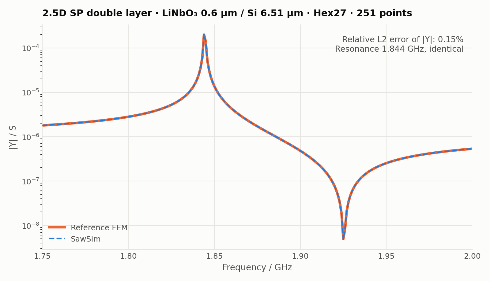
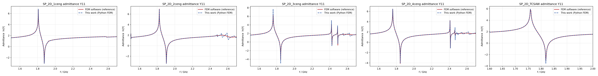

[中文](validation.md) · **English**

# Validation

Every template is compared point by point, without interpolation, with an independent reference finite-element solution computed by a commercial FEM code for the same geometry, materials and boundary settings. The exported reference contains frequency and |Y11| only, no phase. The table lists the full-sweep comparison of 2026-09-11.

| Template | Points | Relative L2 error of \|Y\| | Max pointwise relative error | Main resonance, GHz (sawsim / reference) |
|---|---:|---:|---:|---|
| `sp_single_layer` | 801 | 11.7 % | 13.4 % | 1.8075 / 1.8075 |
| `sp_double_layer` | 801 | 1.58 % | 81.5 % | 1.824 / 1.824 |
| `sp_triple_layer` | 801 | 182 % | 243 % | 1.758 / 1.758 |
| `sp_quad_layer` | 801 | 2.09 % | 321 % | 1.758 / 1.758 |
| `sp_tcsaw` | 201 | 8.03 % | 36.3 % | 1.758 / 1.758 |
| `sp_2p5d_single_layer` | 1201 | 47.2 % | 48.1 % | 1.808 / 1.808 |
| `sp_2p5d_double_layer` | 251 | 0.15 % | 1.56 % | 1.844 / 1.844 |
| `sp_2p5d_triple_layer` | 401 | 1.43 % | 1.54 % | 1.758 / 1.758 |
| `sp_2p5d_quad_layer` | 301 | 6.67 % | 27.2 % | 1.898 / 1.898 |

2.5D templates compare the total slice admittance (S), not the aperture-normalised value.

## How to read the numbers

- **Resonance and anti-resonance frequencies agree with the reference for every template**, which are the two most important quantities of an admittance curve.
- **The large errors of the 2D multilayer templates (double, triple, quad) are concentrated above about 2.4 GHz in the higher-order mode region**, where the curve has several sharp peaks and a small frequency shift produces a large pointwise error. Almost all of the 182 % L2 error of the triple layer comes from that region; around the main resonance the error is at the 1 % level. The cause is still being analysed; candidates are the PML material convention (2D templates assign the main piezoelectric material) and mesh differences in the reference model.
- **`sp_single_layer` and `sp_2p5d_single_layer` show a uniform magnitude offset** (about 12 % and 47 %) with matching peak positions. A uniform ratio of this kind usually comes from a mismatch in admittance normalisation or electrode-area convention and has not yet been reconciled item by item with the reference model.
- `sp_2p5d_double_layer`, `sp_2p5d_triple_layer`, `sp_double_layer` and `sp_quad_layer` agree to 0.1 – 2 % around the main resonance.

These numbers describe the current state, not a final accuracy claim. Entries with larger errors will be updated as the reconciliation progresses.

## How the tests reproduce this

`tests/test_templates.py` runs the solver on 5 – 6 frequencies per template, chosen to land exactly on the frequency grid of the comparison above. Two assertions per template:

1. **Regression**: relative difference to the curve published with this solver ≤ 2 × 10⁻³ (PARDISO and SuperLU differ by about 10⁻⁴).
2. **Reference**: maximum relative error to the reference not above `reference_rtol` in `tests/data/<model>.json`, which is 1.5 × the error measured at the same frequencies in the comparison report; 2D multilayers are compared below 2.35 GHz only.

The npz files in `tests/data/` hold the full frequency grids, the published curves and the reference curves for your own plots or finer comparisons.

## Comparing with other software

- Use the same material tensors, reference axes and Euler convention (see [Materials and orientation](materials-and-orientation.en.md)); check the rotated tensors in `material_snapshot.json` first.
- 2D results are admittance per unit aperture (S/m); for 2.5D compare total admittance via `raw_admittance_s` in `admittance.npz`.
- PML material, thickness and frequency-dependent parameters of the reference model must match; this project uses the last sweep frequency as the PML reference frequency.
